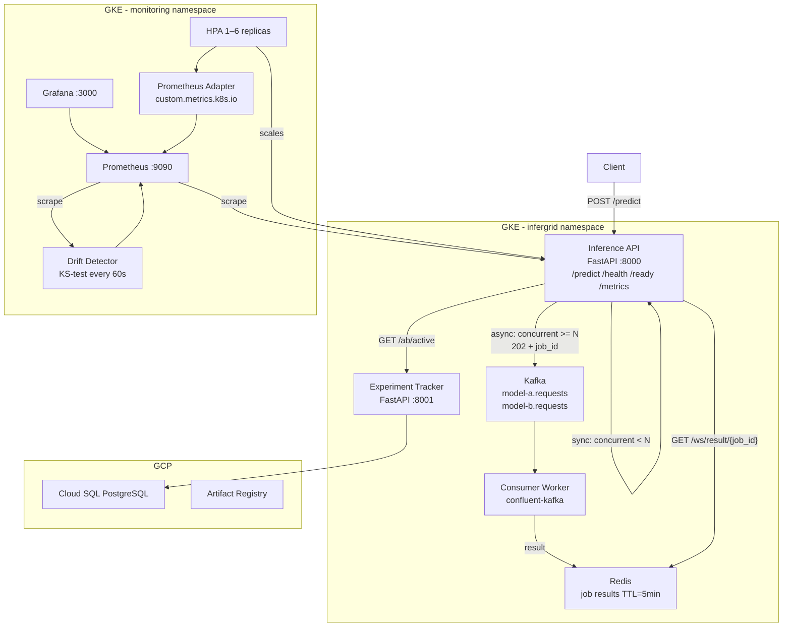
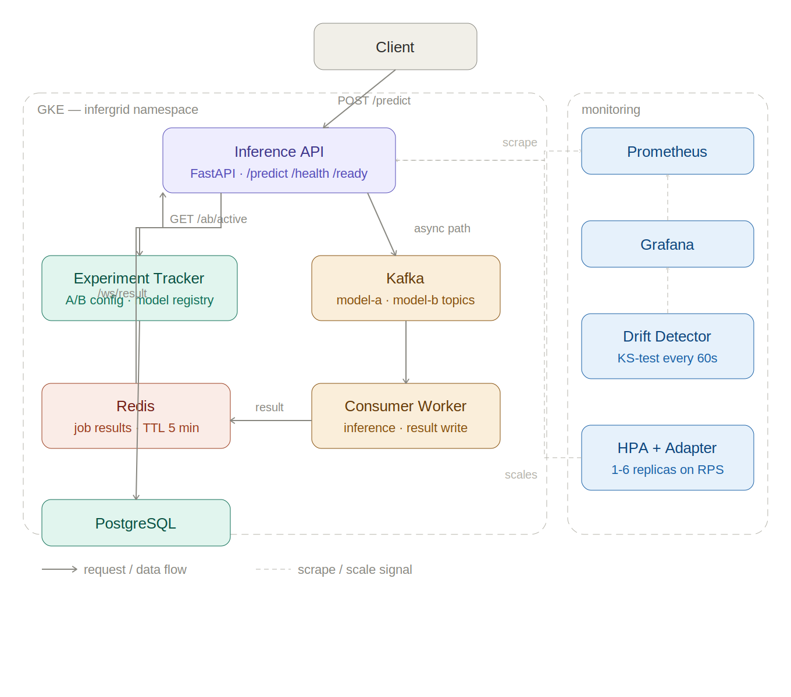
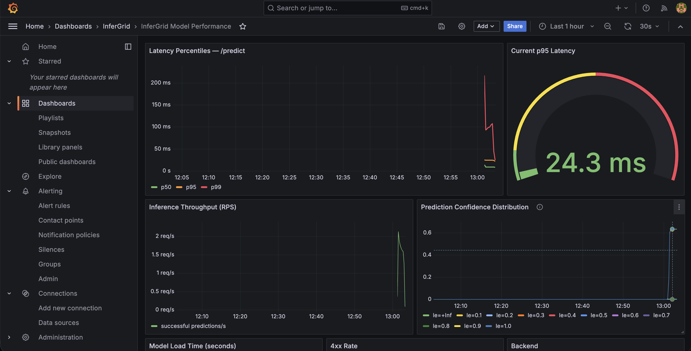

# InferGrid

A distributed ML inference platform I built to learn what it actually takes to run a model in production - not just serve predictions, but handle traffic spikes, detect when the model starts behaving differently, and safely roll out new versions without taking anything down.

The system runs on GKE and has been load tested to 200 concurrent users with zero failures. The async path (Kafka queue → consumer worker → WebSocket delivery) sustains 699 RPS at 200 users. The sync path holds under 100ms p95 up to 50 users.

> **Live endpoint:** `http://35.255.145.27`  
> **Stack:** Python · FastAPI · Kubernetes · Kafka · Redis · Prometheus · Grafana · PostgreSQL · GCP

---

## What it does

When a request comes in, the inference API decides whether to process it inline or hand it off to a background worker depending on how many requests are already in flight. Either way, the result goes through the same observability pipeline - every prediction is counted, timed, and its confidence score recorded in Prometheus.

A separate drift detector runs every 60 seconds, comparing the live confidence distribution against a baseline snapshot using a KS-test. If the distributions diverge past a threshold, a Prometheus alert fires. The idea is to catch silent failures - cases where the model is technically running but producing systematically different outputs than it did at evaluation time.

Traffic routing is handled by an Experiment Tracker service backed by PostgreSQL. You register model versions, seed evaluation metrics, and configure a traffic split. The inference API calls the tracker on each request and routes to model A or model B based on the configured weight, with a 500ms timeout and automatic fallback if the tracker is slow.

---

## Architecture



---

## Benchmarks

Model: sklearn TF-IDF + LogReg · GKE endpoint · 60s per scenario

### Sync path

| Users | p50 | p95  | p99  | RPS   |
|-------|-----|------|------|-------|
| 10    | 45ms | 61ms | 240ms | 14.2 |
| 50    | 46ms | 90ms | 230ms | 70.5 |
| 100   | 48ms | 120ms | 230ms | 139.5 |
| 200   | 57ms | 230ms | 390ms | 272.2 |

### Async path

| Users | p50  | p95   | p99   | RPS   |
|-------|------|-------|-------|-------|
| 200   | 190ms | 360ms | 450ms | 699.0 |

Zero failures across 67,963 requests. The async path includes Kafka enqueue, consumer inference, Redis write, and HTTP poll latency - so 360ms p95 is the honest end-to-end number.

The p99 spike at low user counts (240ms at 10 users) is the sklearn model occasionally taking longer on longer input texts. It is a known characteristic of TF-IDF vectorization and not a platform issue.

---

## Local quickstart

You need Docker, docker-compose, and Python 3.11+.

```bash
git clone https://github.com/YOUR_USERNAME/infergrid.git
cd infergrid

# Start everything
docker-compose up -d

# Send a prediction
curl -X POST http://localhost:8000/predict \
  -H "Content-Type: application/json" \
  -d '{"text": "NASA launched a new rocket toward the ISS today."}'

# Open Grafana
open http://localhost:3000  # admin / infergrid
```

For Kubernetes locally:

```bash
chmod +x inference-api/k8s/scripts/kind-up.sh
./inference-api/k8s/scripts/kind-up.sh

curl http://localhost:30080/health
```

---

## GCP deployment

### 1. Provision infrastructure

```bash
gsutil mb -l us-central1 gs://infergrid-prod-tfstate

cd infra/terraform
terraform init
terraform apply
```

Takes about 10 minutes. Provisions a GKE cluster, node pool, and Artifact Registry.

### 2. Deploy services

```bash
# Inference API
./inference-api/k8s/scripts/gke-deploy.sh

# Kafka
./async-queue/kafka/deploy.sh

# Redis and consumer worker
kubectl apply -f async-queue/redis/redis.yaml
kubectl apply -f async-queue/consumer/k8s/deployment.yaml
```

### 3. Deploy observability

```bash
# Prometheus
./observability/prometheus/deploy.sh

# Grafana with all three dashboards
./observability/grafana/build-dashboard-configmap.sh

# Record drift baseline and deploy detector
python observability/drift_detector/register_baseline.py \
  --endpoint http://35.255.145.27 \
  --samples 500 \
  --output baseline.npy

kubectl create configmap drift-baseline \
  --namespace monitoring \
  --from-file=baseline.npy \
  --dry-run=client -o yaml | kubectl apply -f -

kubectl apply -f observability/drift_detector/k8s/deployment.yaml
```

### 4. Validate

```bash
curl http://35.255.145.27/health
curl http://35.255.145.27/ready
curl -X POST http://35.255.145.27/predict \
  -H "Content-Type: application/json" \
  -d '{"text": "NASA launched a new rocket."}'

# Grafana
kubectl port-forward -n monitoring svc/grafana 3000:3000
open http://localhost:3000
```

---

## Repository layout

```
infergrid/
├── inference-api/        # FastAPI inference service + Kubernetes manifests
│   ├── app/
│   │   ├── main.py       # Routes, middleware, lifespan
│   │   ├── ab_router.py  # A/B routing against Experiment Tracker
│   │   ├── producer.py   # Kafka producer for async path
│   │   ├── websocket.py  # WebSocket + HTTP fallback for job results
│   │   └── metrics.py    # Prometheus instrumentation
│   └── k8s/
├── experiment-tracker/   # Model versioning + A/B config service
│   ├── api/              # FastAPI endpoints
│   └── db/               # SQLAlchemy models + Alembic migrations
├── async-queue/
│   ├── kafka/            # Helm values + deploy script
│   ├── redis/            # Deployment manifest
│   └── consumer/         # Kafka consumer worker
├── observability/
│   ├── prometheus/       # Deployment + scrape config + alert rules
│   ├── grafana/          # Three dashboard JSON exports
│   └── drift_detector/   # KS-test worker
├── infra/terraform/      # GKE cluster, node pool, Artifact Registry
└── benchmarks/           # Locust load tests + results
```

---

## Development

```bash
cd inference-api
pip install -e ".[dev]"

# Tests
pytest tests/ -v

# Formatting
ruff format .
ruff check .
```

CI runs ruff and pytest on every push. End-to-end tests are marked `pytest.mark.e2e` and excluded from CI - run them locally with both services up.

---

## Observability

Full documentation on the Prometheus metrics, Grafana dashboards, drift detection logic, and alert thresholds is in [docs/observability.md](docs/observability.md).

## Architecture



## Live dashboards

